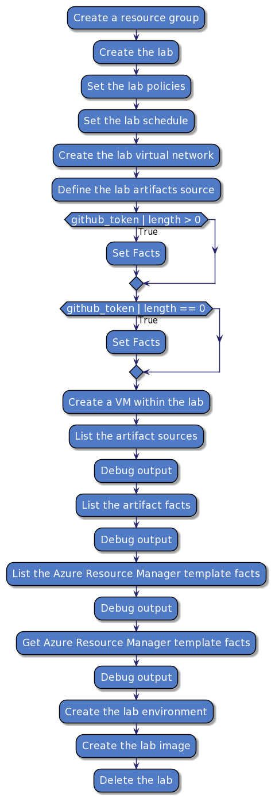

# ansible2puml


[](https://pypi.python.org/pypi/ansible2puml/)
[](https://pypi.python.org/pypi/ansible2puml/)
[](https://pypi.python.org/pypi/ansible2puml/)

## About ansible2puml
Create an PlantUML activity diagram from playbooks and roles trough python.

A .puml file with the PlantUML syntax is generated and a link to display the diagram as PNG is generated.

## Requirements
Python version >3.6

## Install package
Install via pypi
```bash
pip install ansible2puml
```

Install via git
```bash
pip install git+https://github.com/ProfileID/ansible2puml
```

## How to
### Playbook
```
ansible2puml --source play.yml --destination play.puml 
```

## Example
[](./example/example-playbook.yml)  
**Source: [example-playbook.yml](./example/example-playbook.yml)**
